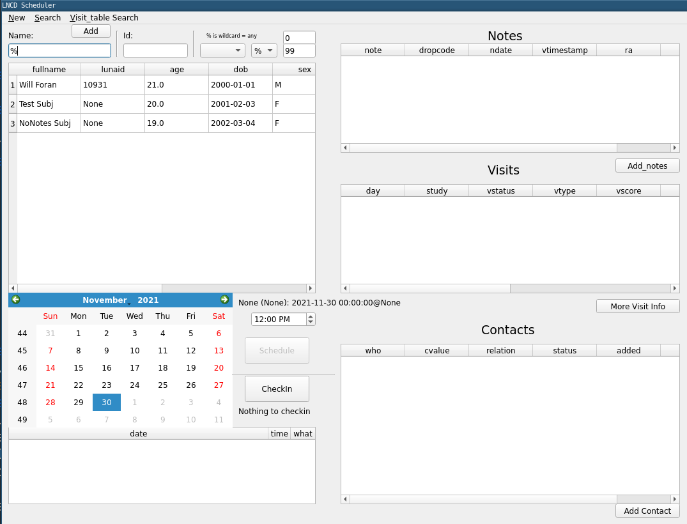

# LNCD scheduler (DB management)

Schedule and record visits to the Laboratory of NeuroCognitive Development.

This is unlikely to be too useful to the world at large.
Integrations are specific to the lab's tools (gcal, qualtrics) and firewall.
The database schema is tied to internal organization of multimodal experiments with human participates.

Instead see components:
 * google calendar: https://github.com/LabNeuroCogDevel/LNCDcal.py
 * qualtrics - `Qualtrics.py`

## Run without install within UPMC firewall
schedule.py is in the path on the main LNCD server.
 - connect to `rhea` (via Mobaxterm/ssh)
 - run scheduler: `schedule.py`
 
## Development
* `make install` will use [`pipenv`](https://pipenv.pypa.io/en/latest/) to manage the python virtual environment. `requirements.txt` also exists, but is currently (2021-11-30) only for travis CI.
* `make test` runs tests. see [Testing section](#testing) and [Travis CI](https://app.travis-ci.com/github/LabNeuroCogDevel/LNCDschedule/)

### DB
for an example postgres database, see `make lncddb_test` (`scripts/fake_db.bash` creates `lncddb_test` DB with example data)

### GUI
* `qtcreator` for visual `ui` files (`designer.exe` with anaconda on windows)
* consider `__name == "__main__"` tests for individual modules so they can be run indpenednetly with `sys.argv` (example [`CheckinVisit.py`](CheckinVisit.py))

### Automatic hooks

| hook | runs | script |
|--------|-----------------------------------------|---|
| commit | [`black`](https://github.com/psf/black) | [scripts/pre-commit](scripts/pre-commit)|
| push   | pytest w/optional Xvfb | [scripts/pre-push](scripts/pre-push)|

Hooks are installed by by `make install` (`ln -s $(pwd)/scripts/pre-*  .git/hooks/`).
They can be ingored using `git push --no-verify`

## Install on windows
Use anaconda to manage python and the dependencies.

 - python: https://www.anaconda.com/download/#windows  (install as user, not system)
 - python libaries/dependencies:anaconda navigator -> environments -> root play -> terminal 
    - upmc cert issue: `conda config --set ssl_verify False`
    - version control: `conda install git`
    - LNCDcal: `pip install --trusted-host github.com git+https://github.com/LabNeuroCogDevel/LNCDcal.py`
    - sql: `conda install psycopg2` `pip install pyesql`
    - gui: `conda install pyQt5`
 - app: 
    - anaconda navigator -> projects -> import -> from folder

20190712 - pyqt5 update issue, current fix `pip install pyqt5==5.12.2`
https://github.com/pyinstaller/pyinstaller/issues/4293

### Secrets
There are two files needed but not in the repo. These carry google (gcal), qualtircs (api), and database authentication.
 * `config.ini` configuration settings (db info, qualtrics, cal info). See [`config.ini.example`](config.ini.example).
 * `*.p12` gcal cred file for service account

## Notes

### Testing
use `make test`, same as `pipenv run python -m pytest`

  * Depends on `pytest`, `pytest-qt` and `pytest-pgsql`. see `make install` (`pipenv install --dev`)
  * within `tests` directory, but expects to be run at root directory (`./sql/` and `./*py` files)
  * makes use of pytest autoloaded `conftest.py` to provided schema loading through shared test fixture `create_db`

#### UI
 * `qtbot` w/`lncdapp` fixture (defined in [`tests/conftest.py`](tests/conftest.py))

#### DB
`create_db` fixture in [`tests/conftest.py`](tests/conftest.py) uses `transacted_postgresql_db` from `pytest-pgsql`. This creates a mocked database using the same `sql/*csv` files with which `scripts/fake_db.bash` creates an actual testing postgres db`lncddb_test`.

### Database

* See `scripts/fake_db.bash` to build a testing database. 
* [`DBeaver`](https://dbeaver.io/) is an excellent tool to visually explore.

#### Summary tables

Visit has some confusing views (with triggers):
 * `visits_view` : json columns full info for visit, no drop info
 * `visits_summary`: most recent note (+ drop values) and action

#### Providence
Schema and triggers are in `sql/` they mirror database building code (not public, `~/src/db/mdb_psql_clj/resources/sql/`)

